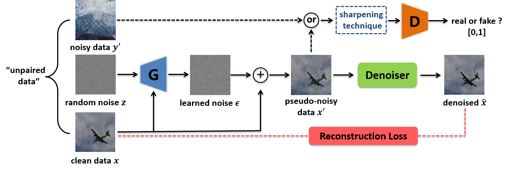
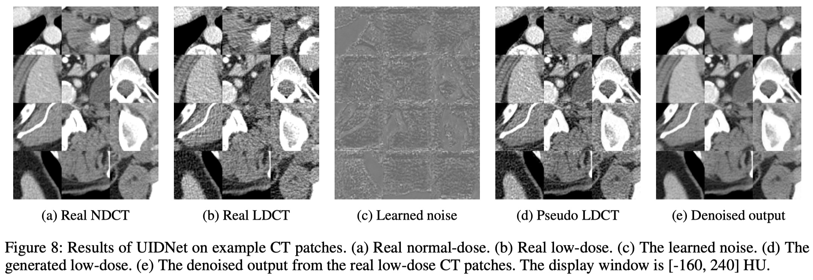
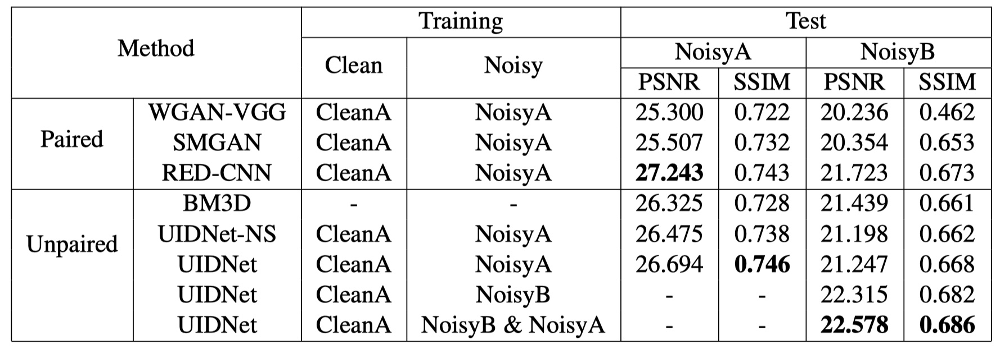

# UIDNet in Tensorflow

The code for the AAAI-20 paper [End-to-End Unpaired Image Denoising with Conditional Adversarial Networks](https://ojs.aaai.org//index.php/AAAI/article/view/5834) ([Aminer version](https://www.aminer.cn/pub/5e5e18ff93d709897ce445d3/end-to-end-unpaired-image-denoising-with-conditional-adversarial-networks)).



## Prerequisites

- Python 3.6
- Tensorflow 1.4.0
- Keras 2.2.4
- SciPy 1.1.0

## Usage

To train a model on Low-dose CT images:

    $ python main.py --ndct ./data/CUT_3mm/cut_clean/ --ldct ./data/CUT_1mm/cut_noise/ --model_name wgan-gp --c_dim 1 --epoch 50 --gpu_id 0


To test with an existing model:

    $ python main.py --ndct ./data/test_1mm/cut_clean/ --ldct ./data/test_1mm/cut_noise/ --model_name wgan-gp --c_dim 1 --epoch 50 --gpu_id 0 --is_train False --checkpoint_dir ckpt_95002


You can refer to [DCGAN-tensorflow](https://github.com/carpedm20/DCGAN-tensorflow) for more examples.
    

## Results of Low-dose CT image denoising





## Citation

If you use this code for your research, please cite our papers.

```
@inproceedings{hong2020end,
  title = {End-to-End Unpaired Image Denoising with Conditional Adversarial Networks},
  author = {Zhiwei Hong and Xiaocheng Fan and Tao Jiang and Jianxing Feng,
  journal = {Proceedings of the AAAI Conference on Artificial Intelligence},
  year = {2020},
}
```